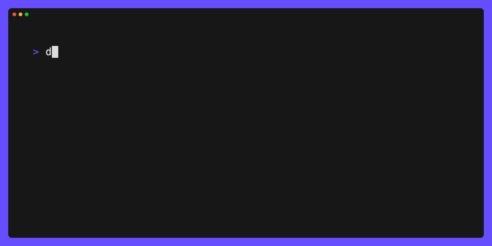

# Backstage Temporary Development Guid

The Dev and Ops team is actively working on bringing backstage to the BB suite of apps. At this time these are the
steps required to get the `stage` version of backstage up and running on your dev cluster.

> NOTE: You will need access to the bigbang-staging  projecet in Iron Bank

## Local Environment

Important: verify you have [enabled buildkit and build](./docs/DEVELOPMENT_MAINTENANCE.md#development-maintenance) on your local machine.

See below steps for setting up local development:

1. Validate node version: `node --version` expected `20.18.x`
2. Validate npm version: `npm --version` expected `10.8.x`
3. Local `docker` and `make` commands available.

Due to the nature of building plugins into the image, we are required to build the backstage image, and then publish it in order
to test it inside of k3d-dev.  Current backstage version is pinned in `backstage/backstage.json`.  The following are steps for building and publishing development
and testing images.

### Build

In the root directory, there is a `Makefile`. If you want to test your changes locally and directly, you can run `make run`.  This will run backstage
as a local app directly to your session, utilizing `backstage/app-config.yaml` as the config, and opening a window with your defaulted browser to backstage homepage.  
If you want to build an image, you can run `make docker-build-multi` which will docker build the `backstage/Dockerfile`.  See the bottom of Dockerfile for changes to
which config is launched as the CMD for the image.

### Publish

Upon image successfully building, you can validate it runs locally using `docker run --rm -it -p 7007:7007 <image ID>`, and visiting an incognito page
at `localhost:7007` (Incognito recommended due to caching). This will run the container with your built image to session, using a merged `backstage/app-config.yaml` and `backstage/app-config.docker.yaml` as the config.

Once the dev image changes are validated, you can tag the image using the following:
`docker tag <image ID> registry1.dso.mil/bigbang-staging/backstage:<tag-name>`
Once tagged, run `docker push registry1.dso.mil/bigbang-staging/backstage:<tag-name>`.  This will publish your tag to IB.

### k3d

Upon publishing your development branch tag, you can modify your image tag override (below) at `initial-start` with the tag name and this will run your built image against bigbang.

## Devbox

Devbox is a command-line tool that helps developers create consistent, isolated development environments by leveraging 
the Nix package manager. It simplifies the process of installing and managing dependencies across different projects, 
ensuring reproducible builds for every team member.

The project has a devbox config. This will ensure you have the specific version of the dependencies needed to build this 
project.

### Installation instructions
Installation is straight forward. Run `curl -fsSL https://get.jetify.com/devbox | bash` if you are on MacOS/Linux. For
other OS install instructions, refer to the documentation:

https://www.jetify.com/docs/devbox/installing_devbox/

> NOTE: It is best practice to review any scripts you download from the internet before just blindly running them.

### Usage

{width=40%}

Once you have devbox installed, simply enter the directory where you have cloned backstage and run `devbox shell`. This
will fire up devbox, which on first run will pull down the appropriate Nix packages and setup the development environment.
From there the commands listed above like `make run` should function without the need to worry about development 
dependencies. 


## Overrides

This makes use of the wrapper project to be able to pull in this chart before its officially part of the big bang echo
system. Anything in the `packages.backstage.values` key will be passed down directly to the chart. You can read more
about the wrapper system [here](https://docs-bigbang.dso.mil/latest/docs/guides/deployment-scenarios/extra-package-deployment/#wrapper-deployment).

Using the following overide you will be able to access the Backstage app at <https://backstage.dev.bigbang.mil>. As of
this writing, the guest login will allow you admin level access.

```yaml
clusterAuditor:
  enabled: false

gatekeeper:
  enabled: false

istioOperator:
  enabled: true

istio:
  enabled: true

jaeger:
  enabled: false

kiali:
  enabled: false

eckOperator:
  enabled: false

fluentbit:
  enabled: false

monitoring:
  enabled: true
  git:
    tag: null
    branch: "grafana-netpol"

neuvector:
  enabled: false

twistlock:
  enabled: false

packages:
  backstage:
    enabled: true
    wrapper:
      enabled: true
    dependsOn:
      - name: grafana
        namespace: bigbang
    git:
      repo: "https://repo1.dso.mil/big-bang/apps/sandbox/backstage"
      tag: null
      branch: "your-branch-here"
      path: "./chart"
    values:
      grafana:
        # The following is the endpoint at which grafana API calls will be accessed through
        url: &grafanaUrl "monitoring-grafana.monitoring.svc.cluster.local"
        http: &grafanaHttp "http"
        # The following is the rewritten URL at which backstage grafana iframe will hyperlink to
        externalUrl: &grafanaExternalUrl "https://grafana.dev.bigbang.mil"
      networkPolicies:
        enabled: true
      backstage:
        serviceAccount:
          name: "backstage"
        backstage:
          args: ["--config", "app-config.yaml", "--config", "app-config.docker.yaml"]
          image:
            repository: "bigbang-staging/backstage"
            tag: "initial-start"
          extraEnvVars:
            - name: GRAFANA_HTTP
              value: *grafanaHttp
            - name: GRAFANA_URL
              value: *grafanaUrl
            - name: GRAFANA_DOMAIN
              value: *grafanaExternalUrl
    
          extraEnvVarsSecrets:
            - grafana-api-token
    
          initContainers:
            - name: backstage-grafana-token
              image: registry1.dso.mil/ironbank/big-bang/base:2.1.0
              command: ["/bin/sh"]
              args: ["-c", "export SVCACCT_ID=$(curl -X POST -H 'Content-Type: application/json' -d '{\"name\": \"backstage-viewer-{{ (randAlphaNum 5) }}\", \"role\": \"Viewer\"}' ${GRAFANA_HTTP}://${GRAFANA_ADMIN}:${GRAFANA_PASS}@${GRAFANA_URL}/api/serviceaccounts | jq -r '.id') && kubectl create secret -n backstage generic grafana-api-token --from-literal=GRAFANA_TOKEN=$(curl -X POST -H 'Content-Type: application/json' -d '{\"name\": \"backstage-grafana-{{ (randAlphaNum 5) }}\"}' ${GRAFANA_HTTP}://${GRAFANA_ADMIN}:${GRAFANA_PASS}@${GRAFANA_URL}/api/serviceaccounts/${SVCACCT_ID}/tokens | jq -r '.key') --dry-run=client -o yaml | kubectl apply -f -"]
              env:
                - name: GRAFANA_URL
                  value: *grafanaUrl
                - name: GRAFANA_HTTP
                  value: *grafanaHttp
                - name: GRAFANA_ADMIN
                  valueFrom:
                    secretKeyRef:
                      name: monitoring-grafana
                      key: admin-user
                - name: GRAFANA_PASS
                  valueFrom:
                    secretKeyRef:
                      name: monitoring-grafana
                      key: admin-password
              securityContext:
                runAsNonRoot: true
                runAsUser: 1001
                runAsGroup: 1001
                capabilities:
                  drop:
                    - ALL
    istio:
      hosts:
        - names:
            - backstage
          gateways:
            - public
          destination:
            port: 7007
```
